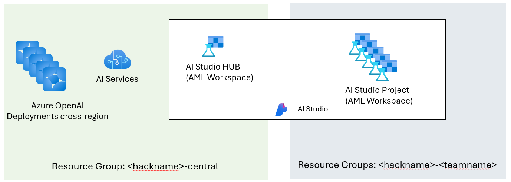

# Example Infra-as-Code to create Intelligent Hack environment

This bicep creates the following structure to support Intelligent Apps Hacks

* A single regional AI Hub with linked AI Service containing model deployments
* A Resource group and AI Project per team, that is linked to the regional Hub





## To Deploy

Using `az` cli, and `subscription` scoped deployment:

```
TENANT=xx.onmicrosoft.com
SUBSCRIPTION_ID=xx
az login --tenant $TENANT
az account set -s $SUBSCRIPTION_ID
az deployment sub create -n <deployment-name> --parameters main_emea.bicepparam --parameters uniqueName=<your-unique-prefix> -l northeurope
```

To Deploy the Costly VM Policy restriction
```
az deployment sub create  --template-file policy.bicep -l northeurope
```