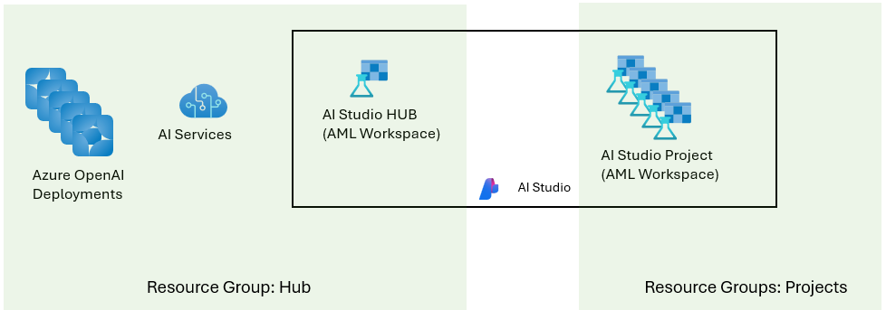

# Example Infra-as-Code to create Intelligent Hack environment





## To Deploy

Using `bicep`, and `subscription` scoped deployment:

```
az deployment sub create  --parameters main.bicepparam -l westeurope
```